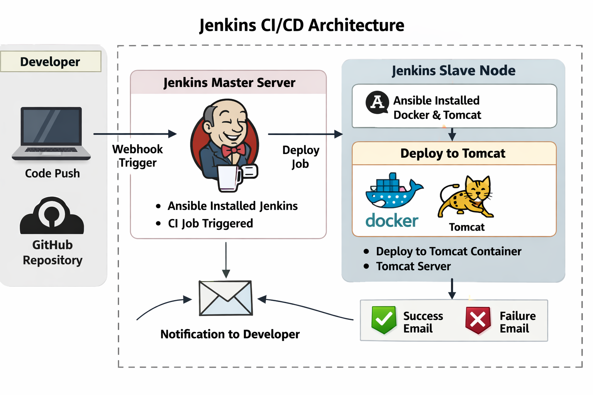

# DevOps CI/CD Automation Task


# Infrastructure Setup

## Create 3 Servers

| Server Name | Purpose |
|---|---|
| Ansible Server | Automation and configuration management |
| Node-1 | Jenkins Master Server |
| Node-2 | Jenkins Slave/Agent + Docker + Tomcat |

---

# Task 1: Configure Ansible Server

- Install Ansible
- Create inventory file for Node-1 and Node-2


---

# Task 2: Install Jenkins on Node-1 Using Ansible Playbook

## Requirements

Create an Ansible playbook to:
 - Install Jenkins
---

# Task 3: Install Docker and Tomcat on Node-2 Using Ansible Playbook

## Requirements

Create an Ansible playbook to:
 - Install Docker
 - Install Tomcat


---

# Task 4: Configure Jenkins Master and Slave

## Requirements

### Configure Node-1
- Use Node-1 as Jenkins Master Server

### Configure Node-2
- Add Node-2 as Jenkins Slave/Agent
- Configure SSH-based connection
- Verify slave connection status

## Expected Result

- Jenkins Master connected to Slave node
- Jobs executed on Node-2

---

# Task 5: Configure GitHub Webhook

---

# Task 6: Create Jenkins Pipeline Using Jenkinsfile

## Requirements

Create a Jenkinsfile pipeline to Deploy:
build maven project and deploy into Tomcat server and Tomcat container too


---

# Task 7: Deploy Maven Application

## Deployment Targets

| Deployment Type | Location |
|---|---|
| Tomcat Server | Node-2 |
| Tomcat Docker Container | Node-2 |

## Expected Result

### Tomcat Server URL

```text
http://<NODE2-IP>:8080
```

### Docker Container URL

```text
http://<NODE2-IP>:8081
```

---

# Task 8: Configure Email Notifications

## Requirements

Configure Jenkins Email Extension Plugin to send notifications for:

- Build Success
- Build Failure

## SMTP Configuration

Configure:
- SMTP Server
- Port
- Authentication
- App Password

## Expected Result

### Success Email
Sent when build and deployment complete successfully.

### Failure Email
Sent when build or deployment fails.


---

# Task 10: Validate Complete CI/CD Workflow


---

# Final Deliverables

## Deliver the Following

### Infrastructure
- 3 configured servers

### Ansible
- Inventory file
- Jenkins installation playbook
- Docker and Tomcat installation playbook

### Jenkins
- Master-Slave configuration
- Jenkins pipeline job

### GitHub
- Configured webhook

### Deployment
- Maven application deployed to:
  - Tomcat Server
  - Docker Tomcat Container

### Notifications
- Success and failure email alerts
